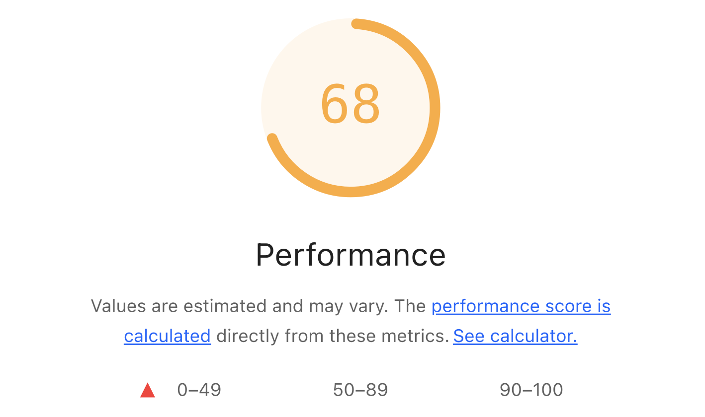
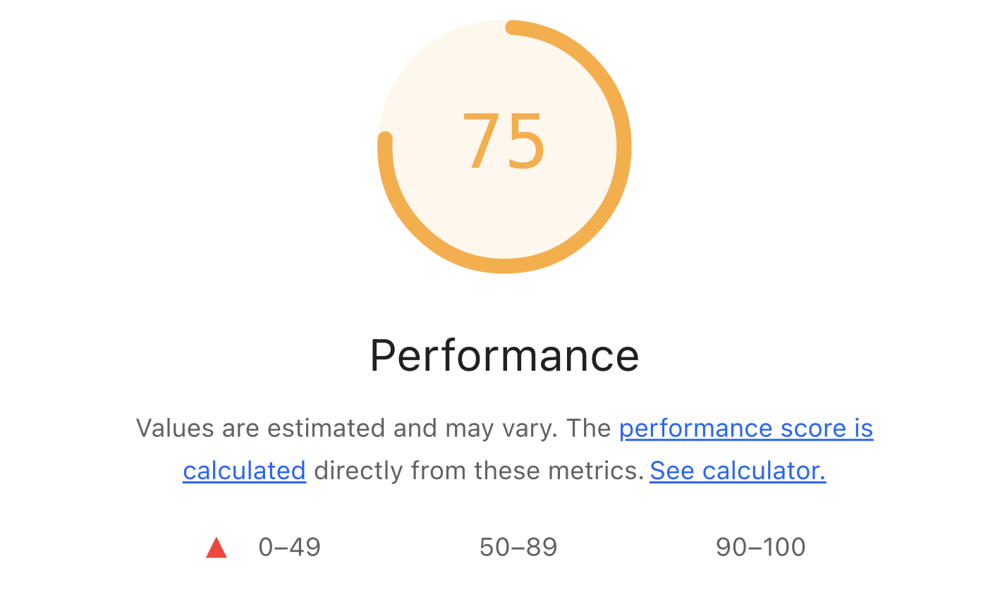
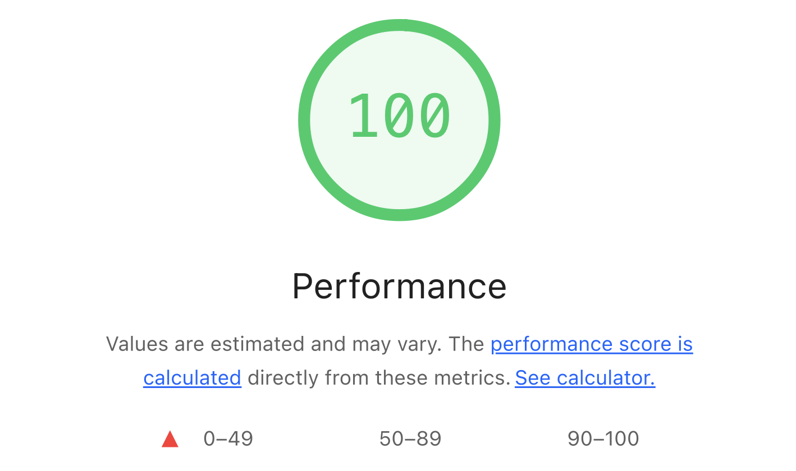
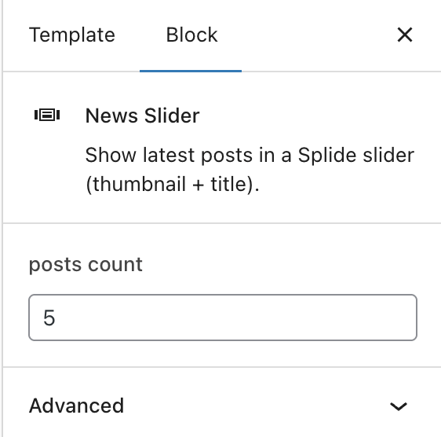
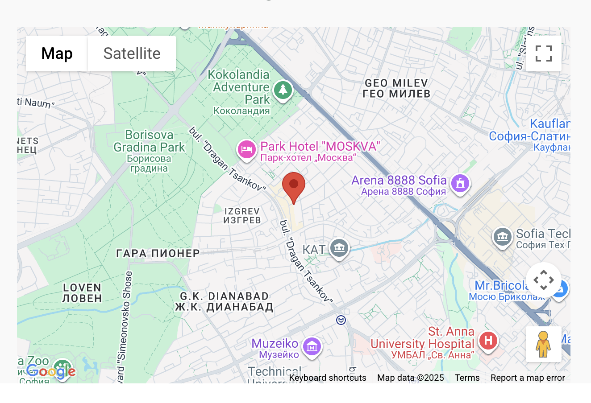
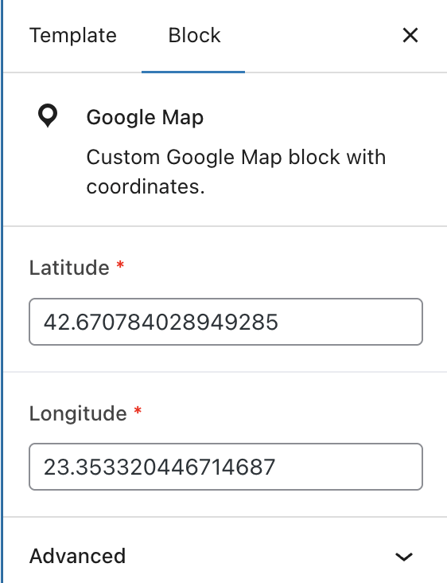

# Twenty Twenty-Four Child — Frontend Performance & Gutenberg блокове

Локална WordPress инсталация (Laravel Herd + nginx) с дъщерна тема `twentytwentyfour-child`. Работата включва изпълнени оптимизации за производителност (изображения, шрифтове, критични ресурси) и разработка на два Gutenberg блока с ACF Pro.

---

## Локална среда
- WordPress.
- PHP development environment: **Laravel Herd**
- Сървър: **nginx**.
- Дъщерна тема: `twentytwentyfour-child`.
- ACF Pro е използван за блоковете.

---

## Начално състояние (Lighthouse)
- **Първоначални резултати:**  
  - Mobile: **68**  
  - Desktop: **94**

---

## Направени оптимизации

> Репорти в pdf формат след всяка от съпките има в `before-after-assets`.

### 1. Improve image delivery
- Проблем: трите изображения на началната страница бяха WebP, но не разполагаха с генерирани image sizes; Lighthouse сигнализираше, че файловете са по-големи от необходимото (пример: файл 1200×799 за display 692×461).
- Действие: свалени са оригиналните изображения и са качени в **Media Library**, за да може WordPress да генерира допълнителни размери (`srcset`/`sizes`).
- Резултат след тази стъпка:  
  - Mobile: **75**  
  - Desktop: **98**

### 2. LCP request discovery
- Проблем: Lighthouse препоръчваше добавяне на `fetchpriority="high"` за LCP изображението.
- Действие: добавено `fetchpriority="high"` за първото изображение на началната страница чрез редакция на блока като HTML.
- Резултат: предупреждението за LCP request discovery вече не се показва.

> Възможно е да се направи така, че първото изображение във всеки пост винаги да има `fetchpriority="high`.

### 3. Network dependency tree
- Проблем: critical path latency с шрифтове и няколко малки CSS/JS; Lighthouse показваше `Maximum critical path latency ~134 ms`.
- Действия:
  - Добавяне на `font-display: swap;` чрез `theme.json` в дъщерната тема.
  - Инсталиране на **WP Fastest Cache** и използване на опцията за минифициране на CSS и JS.
- Резултат: `Maximum critical path latency` спадна от **134 ms** на **37 ms**.

---

## Финални резултати (след описаните стъпки)
- **Mobile:** **100**  
- **Desktop:** **100**

**Speed Index**  
- Mobile — преди: **3.9 s** → след: **0.7 s**  
- Desktop — преди: **0.9 s** → след: **0.2 s**

---

## Gutenberg custom blocks
- За разработката на блоковете е използван **ACF Pro**.
- Създадени са два блока:
  - **News Slider** — използва SplideJS (lightweight slider library); показва последните 5 поста с thumbnail изображения и заглавие под всяко изображение. Има възможност за избор на брой постове. Има валидация за min и max брой постове. 
  
    
    

  - **Google Map** — блок, който използва ACF полета `latitude` и `longitude` и показва Google Map с маркер на посочените координати. Полета `latitude` и `longitude` са задължителни.
    > За да работи картата се изисква API ключ. Добавете в wp-config.php  `define( 'GMAPS_API_KEY', 'your api key' );`

    
    

